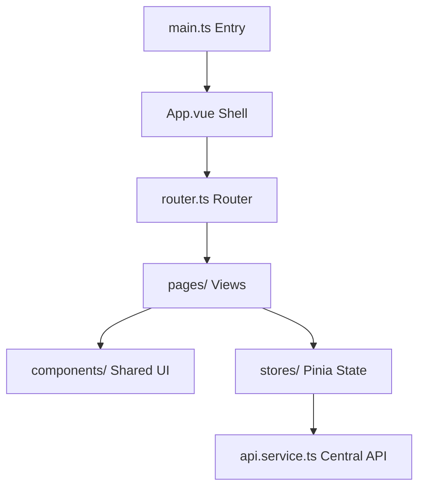

# Frontend Developer & Agent Guide (ENHANCED)

Welcome to the `web/` directory! This is the frontend SPA of the SHP-Learner platform. It is built as a highly responsive, modern SPA using Vue 3, Vite, Pinia for store states, Tailwind CSS v4, and `@unhead/vue` for dynamic SEO tags.

---

## 🚀 Quick Start & Scripts

Ensure your dependencies are fully installed and run dev servers:

```bash
# 1. Access the web workspace
cd web

# 2. Install all typed packages
npm install

# 3. Start local development server
npm run dev

# 4. Perform type-checking and ESLint standard checks
npm run lint

# 5. Build optimized production assets
npm run build
```

---

## 📂 Architecture Map



*   `src/main.ts`: Application bootstrap (initializes Pinia, Router, and Unhead client).
*   `src/App.vue`: Root Vue element holding the base layout grid.
*   `src/router.ts`: Vue Router declarations with lazy-loaded route modules.
*   `src/pages/`: Route-level container pages (e.g. `Home`, `CourseDetail`, `QuizTake`, `FAQ`, Auth flows).
*   `src/components/`: Reusable UI elements (`AlertMessage`, `AppCard`, `AppButton`).
*   `src/stores/`: Pinia stores implementing reactive states:
    *   `userStore.ts`: Authentication state, user profile session, and cache.
    *   `courseStore.ts`: Fetched courses list and dynamic lookups.
    *   `enrollmentStore.ts`: Student enrollments and progress levels.
*   `src/services/api.service.ts`: Centralized HTTP Client mapping endpoint requests with automatic CSRF integration.

---

## 🛠️ API & Local Integration Guidelines

*   **Backend Base Target:** Configured using `VITE_APP_BACKEND_URL` environment variables (defaults to `http://localhost:8000`).
*   **CSRF Authentication:** All POST, PUT, PATCH, and DELETE calls automatically query standard `csrftoken` cookies and bind them to the request headers using `X-CSRFToken` to guarantee secure operations.
*   **Credentials:** Requests default to `credentials: 'include'` for cookies integration.

---

## 🎯 Code Quality & Standards

1.  **State Isolation:** Do not implement direct `fetch` inside Vue components. Always write endpoint integrations inside `api.service.ts` and dispatch actions using Pinia stores.
2.  **Linting Rules:** The ESLint configuration uses standard Vue rules under flat configurations (`eslint-plugin-vue`). Run local checks before pushing commits.
3.  **SEO Hygiene:** Always update the page metadata using dynamic page-level composables (e.g. `useCourseSEO` inside `useSEO.ts`).
